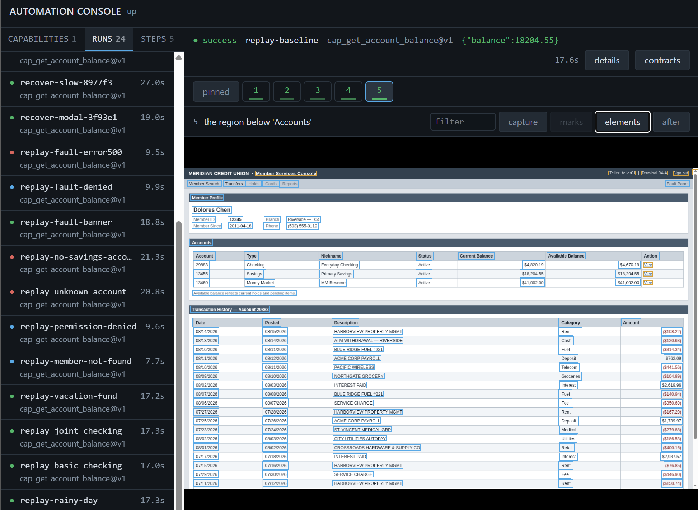
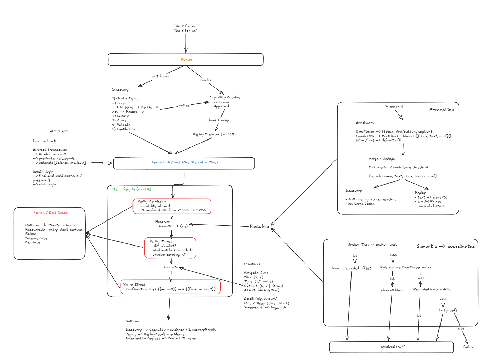

# Computer-Use Automation

An LLM discovers a goal on a real UI, records a typed capability, and that capability replays
deterministically without an LLM. The implementation uses visual perception and input events rather
than DOM locators, so the core model also applies to legacy web and desktop surfaces.

[Design write-up](REPORT.md) · [Evidence](evidence/README.md)

## Quickstart

Prerequisites: Docker with Compose. For local development, install uv, Node 20+, and pnpm.

```bash
cp .env.example .env
make up
docker compose exec desktop python3 scripts/fetch_models.py  # one-time model download

docker compose exec desktop cua replay cap_get_account_balance \
  --input member_id=12345 --input account_nickname="Primary Savings"
```

`make up` builds and starts all three services detached; `make logs` follows them.

Without an NVIDIA GPU and container toolkit, Compose fails on the `deploy:` block in
`docker-compose.yml`. Delete that block and set `CUA_OCR_ENGINE=onnxruntime` in `.env`: text
recognition runs on the CPU, ~3x slower per observation for identical output.

The replayed capability is included in the repository and does not require a model key. The
target app is at http://localhost:8080, the operator console at http://localhost:3000, the API
docs at http://localhost:8000/docs, and the live automation desktop at http://localhost:6080.

## Demo

Run these commands in the automation container:

```bash
docker compose exec desktop bash
```

### Discover a capability

Discovery needs a vision-and-tool-calling model. Configure one provider in `.env`:

```bash
CUA_MODEL=xai/grok-4          # XAI_API_KEY
# or anthropic/claude-opus-5  # ANTHROPIC_API_KEY
# or openai/gpt-5             # OPENAI_API_KEY
```

```bash
cua discover \
  --goal "open member 12345 and read the current balance of their Primary Savings account" \
  --input member_id=12345 \
  --input account_nickname="Primary Savings" \
  --capability-id cap_get_account_balance
```

This writes a draft artifact in `artifacts/` and detailed run evidence in `evidence/`. Review it,
then approve it for agent-facing invocation:

```bash
cua approve cap_get_account_balance 1 --operator you
```

### Replay it deterministically

```bash
cua replay cap_get_account_balance \
  --input member_id=12345 --input account_nickname="Primary Savings"
```

Expected result:

```json
{ "status": "success", "outputs": { "balance": 18204.55 } }
```

The same capability demonstrates expected and exceptional paths:

```bash
# Expected business outcome
cua replay cap_get_account_balance \
  --input member_id=99999 --input account_nickname="Primary Savings"

# Recoverable modal / slow screen / expired session
python3 scripts/smoke_recover.py

# Application error
cua replay cap_get_account_balance \
  --input member_id=12345 --input account_nickname="Primary Savings" --fault error500

# Same-session human handoff for a risky fixture
python3 scripts/smoke_escalate.py
```

### When a capability meets a screen it never recorded

A recording only ever sees the happy path, so a capability starts out unable to name the
alternative results a caller branches on. Two commands teach it one, after the fact:

```bash
# You know the case and can reach it with inputs. Replays twice — recorded inputs, then
# yours — and takes the detector from the difference. No model. Emits a new draft version.
cua learn-outcome cap_get_account_balance \
  --name no_matching_account --input member_id=30992 --input account_nickname="Primary Savings"

# A run stopped on a screen you cannot reproduce. Reads its evidence and proposes a
# declaration — the model picks a line by index, never a phrase, and the pick is falsified
# against successful runs. Writes diagnosis.json and prints YAML for policies/<app>.yaml.
cua diagnose replay-unknown-account
```

Neither applies anything: one emits a draft for review, the other a patch for a person to
paste. A model that could rewrite a guardrail is not a guardrail.

See [evidence/README.md](evidence/README.md) for the saved discovery, replay, failure, recovery,
and intervention runs.



The console reads the same evidence directory. On the left, every run and how it ended; on the
right, one step of `replay-baseline` with the `elements` overlay on — each box is something
perception found and the resolver could have been asked for. Step 5 here is the scan that locates
the account row, which is why its scope reads *the region below 'Accounts'* rather than a
coordinate.

## Architecture

```
goal + target
    │
    ├─ discovery: screenshot → elements → LLM mark choice → recorded actions
    │
    ├─ typed, versioned capability artifact
    │
    └─ replay: resolve semantic targets → policy check → input → checkpoint
                                                  │
                                      success / outcome / failure / escalation
```

- `perception/`: screenshot to a surface-neutral element list (OCR + UI detection).
- `action/`: browser/desktop input drivers.
- `discovery/`: LLM loop and artifact synthesis.
- `replay/`: deterministic execution, recovery, outcomes, and verification.
- `policy/`: URL/action allowlists, risk, and runtime conditions.
- `escalation/`: exclusive control and same-session human handoff.
- `evidence/`: frames, observations, structured step records, and interventions.

The artifact’s targets use a resolution ladder: text plus spatial relation, then role/name, then
recorded bounds. Replay logs the winning tier and refuses unresolved or ambiguous targets.



The working sketch, in more detail than the block above. Three parts are worth reading: the **step
lifecycle** in the centre — every step verifies permission, resolves, verifies the target it landed
on, acts, then verifies the effect, and no model is involved in any of it; the **perception panel**
top right, where UI detection and OCR are merged into one element list that discovery draws marks
on and replay indexes spatially; and the **resolver ladder** bottom right, which falls from anchor
text to role/name to recorded bounds and reports which tier won.

It is a design sketch rather than a map of what shipped: the `Router` at the top is the caller this
system is built to serve, not a component in it — picking a capability for a goal is deliberately
out of scope (REPORT §7), and the manifest is the boundary where someone else's router would attach.

## Safety and current limits

The same allowlist and risk policy protects discovery and replay. URLs are checked before and after
actions; risky operations can be blocked or require human confirmation; credentials are configuration
and never artifact inputs. Declared sensitive input values are masked in serialized results.

Evidence redaction for arbitrary screen/OCR content is not complete. All committed demonstration
data is synthetic; this must be completed before the system is used with real customer data.

## Development and verification

```bash
make install      # local dependencies
make dev          # target app + console + API
make test         # backend tests
make lint         # Ruff and strict mypy

# Validate the checked-in evidence index
python3 backend/scripts/index_evidence.py --check
```

The backend test suite uses fakes at the browser/perception seams and requires no browser, display,
model credential, or target app. Offline replay can also evaluate a capability against recorded
frames:

```bash
cua replay cap_get_account_balance \
  --frames /data/evidence/replay-baseline/frames \
  --input member_id=12345 --input account_nickname="Primary Savings"
```

## Repository layout

```
backend/       automation system
targetapp/     deterministic mock credit-union back office
console/       operator and debugging UI
docs/          architecture sketch and console screenshot
policies/      per-application guardrails
artifacts/     versioned capabilities
evidence/      saved demonstrations
scripts/       dev.sh, the no-docker inner loop
tools/         show_step.py — read one step of a finished run
```

`backend/scripts/` holds the smoke runs, the evidence indexer, and the model fetch; inside the
container they are `scripts/`.

Useful operational commands:

```bash
make up | make down | make logs | make shell
make build
docker compose exec desktop python3 scripts/suite.py
```
